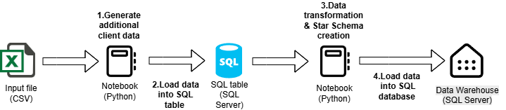
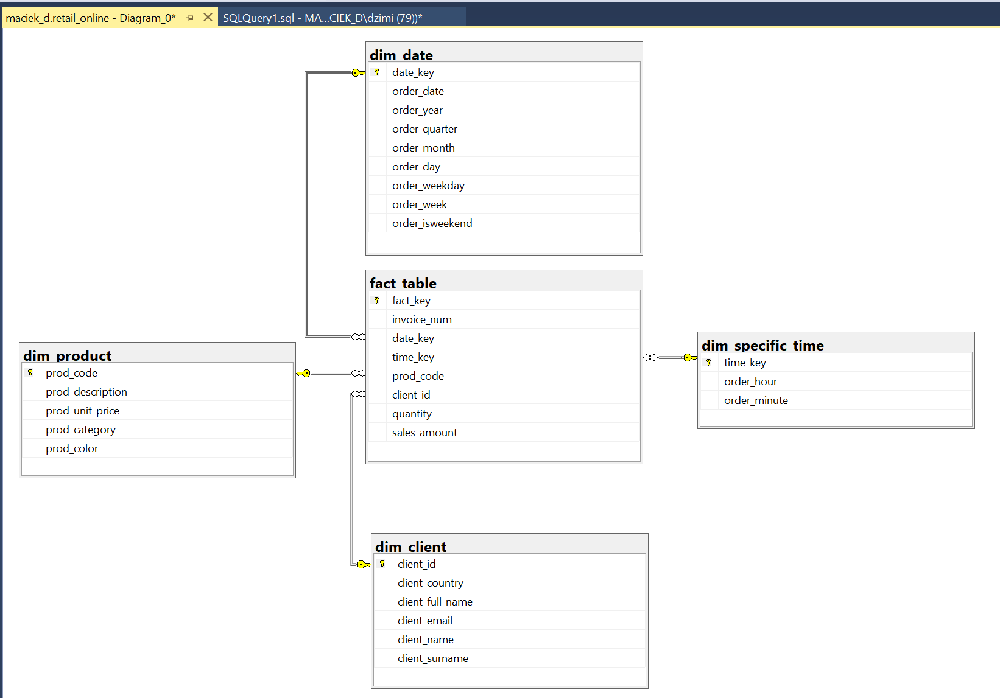

# Data transformation and building Dimensional Data Model
A lightweight data pipeline built with Python and SQL

This project presents a simple data engineering process that ends with a Star Schema in a SQL-based data warehouse.

The diagram below illustrates the overall workflow:

---

## 📦 Dataset

Project based on the Online Retail Dataset from from Kaggle, which contains data on online orders (https://www.kaggle.com/datasets/ishanshrivastava28/tata-online-retail-dataset), which contains online orders data. The dataset is formatted as a single denormalized table with variables related to orders, clients, and products etc.

---

## 🔧 Project Overview

insert_data.ipynb :
- The project begins by loading the CSV file into a Python notebook.
- Additional random client data (first name, last name, email) is generated using the 'names' library.
- The enriched dataset is loaded into a SQL table.

This enriched data in the SQL table serves as the starting point for creating a Star Schema

data_clean_create_wh.ipynb: 
- Load data into Python Notebook using SQLAlchemy
- Perform Data Analysis and Cleaning with pandas
- Predict Product Category and Color based on Product Description using a transformer-based LLM model
- Prepare Dimensional Data (split data, create surrogate keys)
- Create the database schema using SQL queries
- Insert dimensional and fact data using BULK INSERT

